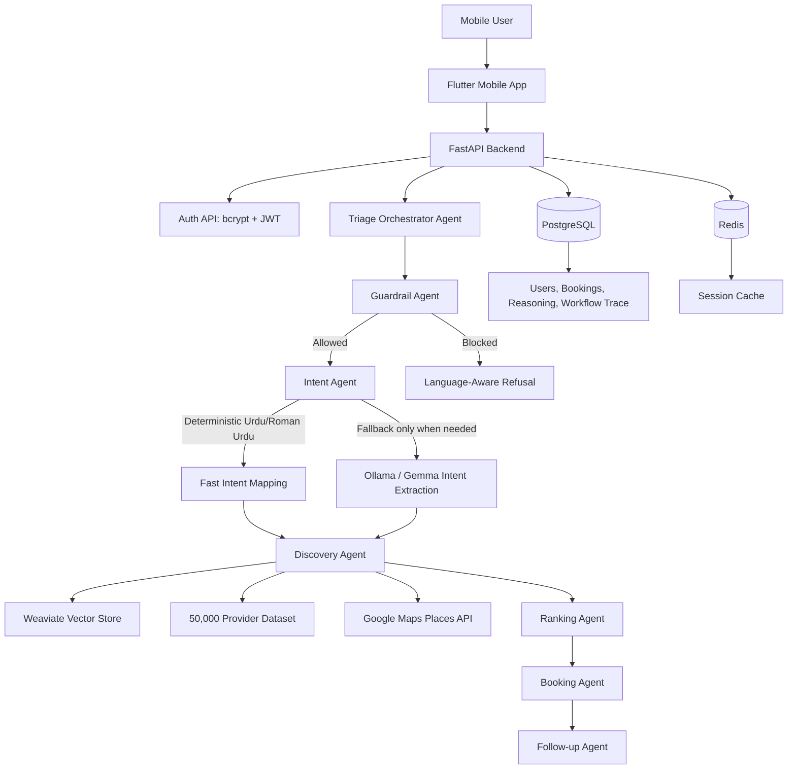
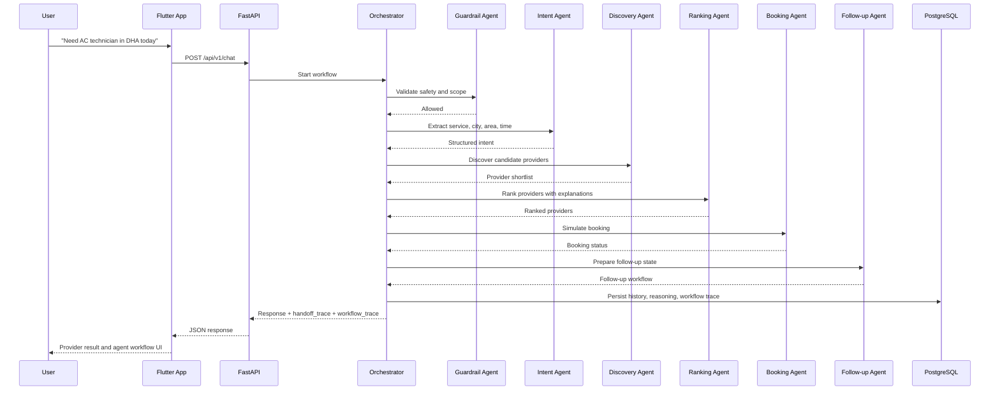

# AI Service Orchestrator for Informal Economy

## Description

AI Service Orchestrator for Informal Economy is a multilingual agentic service-booking platform for Pakistan's informal and local services market.

In many cities, users still rely on WhatsApp messages, informal referrals, phone calls, and manual coordination to find plumbers, electricians, AC technicians, tutors, cleaners, mechanics, and similar service providers. This project demonstrates how an agentic AI workflow can make that process faster, more transparent, and easier to coordinate.

The system supports English, Urdu, and Roman Urdu. A user can describe a service need naturally, and the backend extracts intent, validates safety and scope, discovers matching providers, ranks them transparently, simulates booking confirmation, stores user history, and exposes reasoning/workflow traces for explainability.

## Key Features

- English, Urdu, and Roman Urdu chatbot support.
- Deterministic Urdu/Roman Urdu intent extraction for fast service, city, and area detection.
- Agentic orchestration with visible `handoff_trace` and `workflow_trace`.
- Guardrails for unsafe requests, unsupported services, prompt injection, privacy risks, and out-of-scope queries.
- Provider discovery from a 50,000-provider dataset.
- Transparent provider ranking using rating, availability, location, verification, response time, and retrieval score signals.
- Booking simulation and follow-up workflow state.
- PostgreSQL user history and reasoning trace persistence.
- Redis session/cache state for short-lived conversation continuity.
- Weaviate vector retrieval for provider search.
- Optional Google Maps Places enrichment for nearby/local discovery.
- Secure authentication with FastAPI, PostgreSQL, bcrypt password hashing, and JWT access tokens.
- Flutter mobile app with secure login/signup, chat, provider discovery, and Agent Workflow UI.

## Architecture Overview

The project is structured as a mobile-first agentic service orchestration system.

- **Flutter mobile app**: User-facing client for signup/login, chatbot interaction, provider discovery, booking simulation, and viewing agent workflow traces.
- **FastAPI backend**: API gateway and orchestration layer for auth, chat, provider search, booking simulation, health checks, maps enrichment, and history retrieval.
- **Triage/orchestrator agent**: Coordinates the full workflow and delegates to specialized agents.
- **Guardrail agent**: Blocks unsafe, unsupported, private, prompt-injection, or out-of-scope requests before workflow execution.
- **Intent agent**: Extracts service type, city, area, time, urgency, and booking/FAQ intent using deterministic rules first, with local model fallback only when needed.
- **Discovery agent**: Finds candidate providers from the provider dataset, Weaviate retrieval, and optional Google Maps Places enrichment.
- **Ranking agent**: Scores providers transparently using dataset-derived ranking signals.
- **Booking agent**: Simulates provider booking and stores booking state.
- **Follow-up agent**: Maintains follow-up workflow state and next-step reminders.
- **PostgreSQL**: Stores users, password hashes, user history, booking simulation results, reasoning traces, and workflow traces.
- **Redis**: Stores temporary session/cache state.
- **Weaviate**: Provides vector retrieval over provider data.
- **Google Maps Places API**: Optional enrichment source; the platform still works with the mock/provider dataset when Maps is disabled or no key is configured.
- **Ollama/Gemma local model**: Used only when deterministic extraction and routing are insufficient, keeping the CPU-only deployment lightweight.

## Mermaid Architecture Diagram



## Agent Workflow



## Data and Integrations

The demo uses a provider dataset of 50,000 local service providers for discovery, filtering, coverage, and ranking. This dataset allows the system to run even when external APIs are unavailable.

Google Maps Places is implemented as optional enrichment, not as a hard dependency. If `ENABLE_GOOGLE_MAPS=false` or `GOOGLE_MAPS_API_KEY` is missing, the backend returns a safe fallback response and continues using the provider dataset.

No API keys or private secrets are committed to the repository. Runtime secrets such as `JWT_SECRET`, database URLs, and Google Maps keys must be supplied through environment variables.

## Dataset Analysis

The provider dataset is intentionally broad enough to demonstrate city-level discovery, area filtering, category matching, and transparent ranking. It contains 50,000 synthetic service-provider records distributed across 6 Pakistani cities, 30 local areas, and 14 service categories.

### City Coverage

| City | Provider Count | Share of Dataset |
|---|---:|---:|
| Rawalpindi | 8,435 | 16.87% |
| Lahore | 8,393 | 16.79% |
| Karachi | 8,378 | 16.76% |
| Faisalabad | 8,309 | 16.62% |
| Peshawar | 8,290 | 16.58% |
| Islamabad | 8,195 | 16.39% |
| **Total** | **50,000** | **100.00%** |

### Service Category Distribution

| Service Category | Provider Count |
|---|---:|
| Cleaning Service | 3,675 |
| Beautician | 3,643 |
| Home Tutor | 3,617 |
| AC Technician | 3,613 |
| Tutor | 3,583 |
| Electrician | 3,581 |
| Mobile Repair | 3,578 |
| Water Tank Cleaner | 3,561 |
| Plumber | 3,558 |
| Appliance Repair | 3,539 |
| Carpenter | 3,528 |
| Mechanic | 3,519 |
| Computer Technician | 3,512 |
| Painter | 3,493 |
| **Total** | **50,000** |

### Area Coverage by City

| City | Areas Covered | Area Provider Totals |
|---|---:|---|
| Faisalabad | 3 | D Ground 2,778; Madina Town 2,790; Peoples Colony 2,741 |
| Islamabad | 5 | Bahria Town 1,569; Blue Area 1,666; F-10 1,614; G-13 1,683; I-8 1,663 |
| Karachi | 7 | Clifton 1,214; DHA 1,220; Gulshan 1,193; Korangi 1,151; Malir 1,205; Nazimabad 1,206; North Nazimabad 1,189 |
| Lahore | 5 | Bahria Town 1,687; DHA 1,696; Gulberg 1,611; Johar Town 1,699; Model Town 1,700 |
| Peshawar | 3 | Cantt 2,816; Hayatabad 2,680; University Town 2,794 |
| Rawalpindi | 4 | Bahria Town 2,113; Chaklala 2,170; PWD 2,080; Saddar 2,072 |

### Dataset Design Notes

- City distribution is intentionally balanced, with each city contributing roughly 16-17% of the dataset.
- Service categories are also balanced, with each category contributing roughly 3,493 to 3,675 providers.
- Area-level density supports realistic filtering such as "plumber in DHA", "AC technician in Hayatabad", or "tutor near Gulshan".
- The balanced synthetic distribution helps evaluate retrieval, ranking, and fallback behavior without depending on live provider availability.

## Mock and Real APIs Used

### Mock / Simulated Components

- **Provider Dataset**: `service_providers_50000.csv` contains 50,000 synthetic providers across 6 cities and 14 service categories.
- **Booking Flow**: Booking is simulated for hackathon demonstration. No real provider dispatch, payment, or SMS/WhatsApp confirmation is performed.
- **Follow-up State**: Follow-up reminders and status transitions are simulated as workflow state.

### Real APIs / Runtime Services

- **Google Maps Places API**: Used for optional real nearby provider enrichment through `/api/v1/maps/nearby`.
- **FastAPI Backend APIs**: Used for auth, chat, discovery, ranking, booking simulation, maps enrichment, and history.
- **PostgreSQL**: Stores users, bcrypt password hashes, booking state, user history, reasoning, and workflow traces.
- **Redis**: Stores temporary session/cache state.
- **Weaviate**: Stores and retrieves provider vectors for semantic provider discovery.
- **Ollama/Gemma**: Used as local fallback intent/reasoning model when deterministic extraction is insufficient.

## Agents Developed

| Agent | Responsibility |
|---|---|
| Triage Orchestrator Agent | Coordinates the full request lifecycle and delegates work to specialized agents. |
| Guardrail Agent | Blocks unsafe, unsupported, privacy-risk, prompt-injection, and out-of-scope requests. |
| Intent Agent | Extracts service type, city, area, time, urgency, language, and clarification needs. |
| Discovery Agent | Retrieves provider candidates from the dataset, Weaviate, and optional Google Maps enrichment. |
| Ranking Agent | Scores providers using rating, availability, response time, experience, verification, price, and location signals. |
| Booking Agent | Simulates booking confirmation and selected provider state. |
| Follow-up Agent | Tracks next-step workflow state, reminders, and booking status transitions. |
| FAQ Agent | Handles common platform/help questions where provider discovery is not needed. |

## Integrations Implemented

- **Flutter Mobile App -> FastAPI Backend** for signup/login, chat, provider search, booking simulation, and workflow trace display.
- **FastAPI -> PostgreSQL** for users, bookings, user history, reasoning, and workflow traces.
- **FastAPI -> Redis** for short-term session/cache state.
- **FastAPI -> Weaviate** for vector retrieval over provider data.
- **FastAPI -> Google Maps Places API** for real nearby provider enrichment.
- **FastAPI -> Ollama/Gemma** for local fallback model inference.
- **Mobile App -> Google Maps Search URL** for opening provider locations safely without exposing API keys in the mobile client.

## Authentication

BetterAuth is not used because the current stack is Flutter + FastAPI, not Node/Next.js.

Secure auth is implemented with:

- FastAPI auth endpoints.
- PostgreSQL `users` table.
- bcrypt password hashing.
- JWT access tokens.
- Flutter local storage for token and user profile metadata only.

Raw passwords are never stored in Flutter local storage and are never persisted in PostgreSQL.

## Technologies and Libraries

- [FastAPI](https://fastapi.tiangolo.com/) - Python web framework for the backend API.
- [Uvicorn](https://www.uvicorn.org/) - ASGI server for FastAPI.
- [PostgreSQL](https://www.postgresql.org/) - persistent relational database.
- [Redis](https://redis.io/) - session/cache layer.
- [Weaviate](https://weaviate.io/) - vector database for provider retrieval.
- [Flutter](https://flutter.dev/) - cross-platform mobile app framework.
- [Google Maps Platform Places API](https://developers.google.com/maps/documentation/places/web-service) - real nearby provider enrichment.
- [Ollama](https://ollama.com/) - local model runtime.
- [Gemma](https://ai.google.dev/gemma) - local fallback LLM.
- [Passlib](https://passlib.readthedocs.io/) - password hashing support.
- [PyJWT](https://pyjwt.readthedocs.io/) - JWT token creation and validation.
- [PM2](https://pm2.keymetrics.io/) - process manager for the VM backend.
- [Docker](https://www.docker.com/) - runtime services for PostgreSQL, Redis, and Weaviate.
- [Sentence Transformers](https://www.sbert.net/) - embeddings for semantic retrieval.

## Relevant Web Concepts

- [HTTP](https://developer.mozilla.org/en-US/docs/Web/HTTP) is used for REST APIs such as auth, discovery, maps, history, and provider search.
- [WebSocket](https://developer.mozilla.org/en-US/docs/Web/API/WebSockets_API) is used for real-time chat interaction with REST fallback.
- [JSON](https://developer.mozilla.org/en-US/docs/Learn/JavaScript/Objects/JSON) is used for structured API responses, intent payloads, ranking details, and workflow traces.
- [URL query parameters](https://developer.mozilla.org/en-US/docs/Web/API/URLSearchParams) are used for provider filters, maps nearby search, and discovery endpoints.

## Main API Surface

- `POST /api/v1/auth/signup`
- `POST /api/v1/auth/login`
- `POST /api/v1/auth/logout`
- `GET /api/v1/auth/me`
- `POST /api/v1/chat`
- `GET /api/v1/discovery/cities`
- `GET /api/v1/discovery/categories`
- `GET /api/v1/discovery/coverage`
- `GET /api/v1/providers`
- `POST /api/v1/bookings`
- `GET /api/v1/history`
- `GET /api/v1/history/{session_id}`
- `GET /api/v1/maps/nearby`
- `GET /health`

## Repository Layout

```text
.
├── backend/
│   └── generative_ai_project/
│       ├── src/
│       │   ├── agents/              # Orchestrator, guardrail, intent, discovery, ranking, booking, follow-up, FAQ agents
│       │   ├── api/                 # FastAPI app, routes, request/response schemas
│       │   ├── core/                # Guardrails, Google Maps integration, runtime config, language helpers
│       │   ├── rag/                 # Embeddings, retriever, Weaviate vector store
│       │   ├── state/               # PostgreSQL and Redis state stores
│       │   ├── processing/          # Provider dataset preprocessing
│       │   └── cag/                 # Cached/golden knowledge context management
│       ├── dataset/                 # Provider CSV dataset used by backend runtime
│       ├── scripts/                 # SQL migrations and backend utility scripts
│       ├── tests/                   # Backend regression and guardrail tests
│       └── evaluation_model/        # Evaluation utilities and reports
├── mobile/
│   └── ProFixer/
│       ├── lib/                     # Flutter app screens, API client, chat UI, auth flow
│       ├── android/                 # Android project and Gradle configuration
│       ├── assets/                  # Mobile assets if provided
│       └── test/                    # Flutter widget tests
├── docs/                            # Challenge and architecture documentation
├── scripts/                         # Shared smoke/evaluation scripts
├── service_providers_50000.csv      # Root copy of synthetic provider dataset
├── README.md
├── FIRST_RELEASE_README.md
├── pyproject.toml
└── uv.lock
```

## Deployment Notes

The backend is designed to run on a CPU-only VM. The deterministic-first routing path keeps latency low, while Ollama/Gemma is reserved for fallback extraction or reasoning when deterministic logic is not enough.

Core runtime services:

- FastAPI application server.
- PostgreSQL for persistent users, history, bookings, reasoning, and workflow traces.
- Redis for temporary session/cache state.
- Weaviate for provider vector retrieval.
- Ollama with Gemma for local fallback model calls.
- Optional Google Maps Places API for enrichment.

## Transparency and Explainability

The response payload includes agent workflow metadata such as `handoff_trace`, `workflow_trace`, ranking details, selected providers, and persisted user history. This is intended to make the orchestration process visible to both users and evaluators, instead of returning an opaque chatbot answer.

## Current Scope

This release is a hackathon-ready demonstration, not a full production marketplace. It honestly combines:

- A large mock/provider dataset for repeatable service discovery.
- Real backend APIs for auth, chat, discovery, health, maps fallback, history, and booking simulation.
- Optional Google Maps Places enrichment.
- Local Ollama/Gemma fallback for lightweight AI reasoning.

Future production work would include real provider onboarding, payment flows, provider-side mobile workflows, verified identity checks, live availability, dispatch operations, and stronger operational monitoring.
